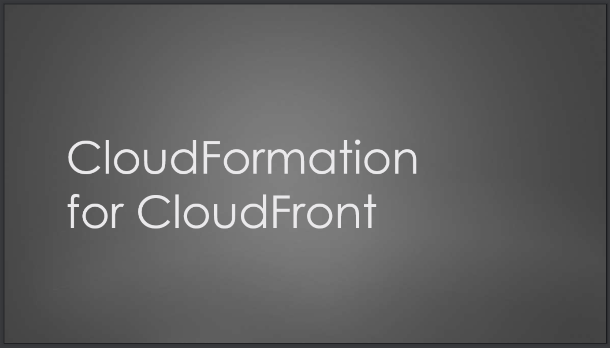

# CloudFormation Talk
Build a CloudFront distribution and migrate to it from another CDN using CloudFormation.

#### Requirements
* [AWS CLI](https://docs.aws.amazon.com/cli/latest/userguide/installing.html)

The demo is in two parts:
* demo #1: Build a simple CloudFront application with CloudFormation
* demo #2: Transition from an existing CDN to CloudFront using Weighted routing DNS in Route53

#### Slides
Check out the [slides](https://1drv.ms/p/s!Al_H-71CJTZJgY5hUn8vf3POPh6uYg) from the talk here:

